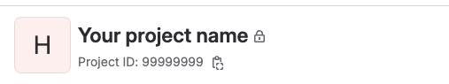

# What is it about?

This is a local dashboard to generate insights on GitLab data.

# Tech Stack

* Bun 1.0.6
* Nodejs 16.10.0 or greater
* Sqlite 3
* Typescript and Javascript

# Frameworks

* Elysia web framework
* React library for web
* Tailwind CSS framework
* Nodemon is a utility to automatically restart your server

# Requirements

This project require that you have **nodejs** installed **v16.19.0 or greater**.

# How to run the project?

Execute the following commands:

```
# install bun
curl -fsSL https://bun.sh/install | bash -s "bun-v1.0.6"
# reload your PATH
source ~/.zshrc
# install dependencies
bun install
# run the application
bun dev.js
```

# Credentials

You need to set private token, project id and base url to use the application

## Project Id
The project id id located right on top of the GitLab page of your repo as the image below indicates:



## Base Url
If you use GitLab cloud this is the base url: https://gitlab.com/api/v4, if you uses an on premises solution contact your GitLab admin.

## Private token
Get your private token at this page: https://gitlab.com/-/profile/personal_access_tokens